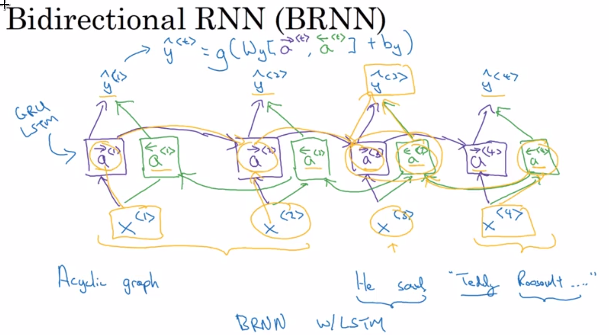

# Sequence Models

[](https://travis-ci.com/dmitryaleks/sequence-models)

Examples of sequences: text, speech, financial time series.

## Notation

<https://www.coursera.org/learn/nlp-sequence-models/lecture/aJT8i/notation>

Eleents of the input sequence:
```
x<1>, x<2>, ..., x<t>,...,x<l>
```

Output (feature) sequence based on the input sequence:
```
y<1>, y<2>, ..., y<t>,...,y<l>
```

Let's also define:
```
Tx: length of the input sequence;
Ty: length of the output sequence.
```

A particular training example (number #i) is denoted as:
```
X(i)
```

Then a particular element of a given training example is denoted as:
```
X(i)<t>
```

Input sequence length is:
```
Tx(i)
```

## Natural Language Processing

### Vocabulary and training set representation

A set of unique words (as in a dictionary) encoded as a vector and addressed by index of a given element in the vector.

Reasonable size of a vocabulary is around 30K, 50K, 100K or more.

Each element (word) of the input example (sequence of words) is than represented as a one-hot vector of a lenght of vocabulary size, where the element corresponding to the word is set to one while all other elements are set to zero.

## Recurrent Neural Networks

<https://www.coursera.org/learn/nlp-sequence-models/lecture/ftkzt/recurrent-neural-network-model>

Applying a standard neural network to a sequence data is problematic due to:
  - varying lenght of input sequences (different examples have different lenghts);
  - it doesn't take element positions into account, so there is a loss of information.

RNN addresses those problems by consuming input sequence element by element, and passing activation values from previous to the next step each time it advances forward. It allows to consume an input sequence of any lenght in a uniform way and also takes sequence features into account (i.e. relative position of elements in the input sequence).

### Architecture

RNN consumes input sequence element by element, and passes activation values from previous to the next step each time it advances forward.


### Forward propagation


Simplified notation:


### Backpropagation through time

<https://www.coursera.org/learn/nlp-sequence-models/lecture/bc7ED/backpropagation-through-time>

Backpropagation pushes losses backwards through the network, calculating derivatives of training parameters and then applying gradient descent to optimize parameters to find the optimal fit.

Defining a loss function, E.g. a cross-entropy loss as in a logistic regression:
```
L<t>(^y<t>, y<t>) = -y(t) * log(^y(t)) - (1 - y(t)) * log(1 - ^y(t))

# a total loss:

L(^y<t>, y<t>) = Sum(L<t>(^y<t>, y<t>))
```


### Different types of RNN architectures

<https://www.coursera.org/learn/nlp-sequence-models/lecture/BO8PS/different-types-of-rnns>

In general case, the length of the input sequence may be different from the length of the ouput sequence.

Examples are as follows:

  * many-to-one: in a Sentiment Classification problem the input is the text of an arbitrary length, while the output is a single integer value indicating the class (E.g. binary 0/1, or more classes).

  * one-to-one: temperature in degerees Celsius mapped to a human readable classification (cold, warm, hot);

  * one-to-many: music generation with the input of a genre and the output is the sequence of notes of the musical piece;

  * many-to-many: machine translation, where RNN starts with "encoder" part that consumes the input sequence of words, followed by a "decoder" part of lenght "b", where "b" is the amount of the words in the output sequence;

One-to-many and many-to-many architecture are exemplified in the following diagram:


Below is the full summary of RNN types:


### Language modeling and sequence generation

<https://www.coursera.org/learn/nlp-sequence-models/lecture/gw1Xw/language-model-and-sequence-generation>

Language modeling entails:

  * using a large corpus of text as a training set:
  * tokenizing sentences and adding <EOS> character (End-of-Sentence) at the end of each sentence;
  * unknown words can be encoded with a special <UNK> token.

#### Speech recognition

Speech recognition model estimates probability of each input sentence in order to pick the most likely one.

In order to do so it consumes words from the input sequence one by one and estimates a probability of each word being in a given position in a sentence.

RNN would be architectured to carry over all previously recognized words to the next unit, where each unit is trying to pick the most probable next word in a sentence given a preceeding sequence of words.

Softmax is a suitable loss function for this task:
```
L(^y<t>, y<t>) = -sum<i>(y(i)<t> * log(^y(i)<t>))

# overall loss:

L = sum<t>(L(^y<t>, y<t>))
```

After training such model on a large corpus of text, it will be able to give probabilities of a given word coming in an input sequence.

This enables calculation of sentence probabilities as follows:
```
P(y<1>, y<2>, y<3>) = P(y<1>) * P(y<2> | y<1>) * P(y<3> | y<1>, y<2>)
```


### Sampling novel sequences from trained models

<https://www.coursera.org/learn/nlp-sequence-models/lecture/MACos/sampling-novel-sequences>

First we train a network as usual, and as the result obtain a "language model" which is essentially is a set of probabilities for a certain word to appear within a certain context built based on the input text corpus (E.g. as the first word, or after a certain sequence of words).

This allows us to generate new sentences as follows by means of the process called "sampling". It works as follows:

  * first, generate the first word by choosing an element from the probability distribution that has resulted from the model training (E.g. by using "numpy.random.choice";

  * for each subseqent step, carry over the sequence from the previous step to be used as an input and again generate a random choice according to the probability distribution learned by the model.

Sampling process is illustrated in the diagram below:


In general, there are two language models:
  * word-level (conventional);
  * character-level.

Word-level models are prevalent.

Character-level models are more demanding in terms of training costs, but has an advantage that it can handle unknown words. Those are sometimes more suitable for some specialized applications, E.g. where unknown words come up often.

### Vanishing gradient problem when training RNN

<https://www.coursera.org/learn/nlp-sequence-models/lecture/PKMRR/vanishing-gradients-with-rnns>

Vanishing gradient problem is the phenomenon in which during backpropagation errors coming from later elements in the model (E.g. last layers) are not affecting earlier layers enough (E.g. first layer), i.e. the influence is vanishing.

As an example, in Natural Language Processing it is possible to have a sentence that has grammatically connected elements that are far apart (E.g. a noun and a corresponding pronous that are both either singular or plural). Vanishing gradient then would result in little regard for those related elements of the sequence as they simply happened to be too far apart.

Unless addressed, vanishing gradient problem leads to RNNs not being able to capture long range dependencies in input sequences.

This problem is different from "Exploding Gradients" in conventional neural networks, where trained parameters blow up, often to NaN values due to numerical overflow. "Gradient Clipping" technique is a relatively robust solution that helps for it (gradient vector rescaling according to some maximum values).

Vanishing gradient problem is more intricate and requires more elaborate solution.


### Gated Recurrent Unit (GRU)

<https://www.coursera.org/learn/nlp-sequence-models/lecture/agZiL/gated-recurrent-unit-gru>

GRU is a modification to the RNN hidden layer, which makes it better to capture long-range connections and helps a lot with the vanishing gradient problem.

A simplified GRU has a notion of a memory cell (C) that is used to carry some important information throughout steps (E.g. whether the topic noun is singular or plural in an NLP task). Memory cell is subject to a "gating" in which a gate operation is applied to the memory cell at every step. Gate operation either takes a newly candidate for the memory cell value or takes pick a memory cell value from the previous step.

Both memory cell value calculation and gate calculation contain trainale parameters and therefore are fit to the training set during the training phase. Training of those parameters results in picking up the most useful values for the memory cell (C) and caryying them for as long as it is required to get the best fit for the training set.

A simplified GRU can be depicted as follows:


Full GRU can be depicted as follows (note a new Gamma_r term that captures relevance of a memory cell value from the previous step to a subsequent step):


### LSTM

<https://www.coursera.org/learn/nlp-sequence-models/lecture/KXoay/long-short-term-memory-lstm>

LSTM (Long Short Term Memory) is a more powerfull alternative to GRU that allows learning long range connections in sequences.

LSTM has three gates instead of two in GRU (Update Gate and Reelvance Gate). Those are:
  * update gate (G_u);
  * forget gate (G_f);
  * output gate (G_o).

Notes that gates "G" as well as memory cell "C" can be multi-dimensional (i.e. a memory cell can carry lots of information).


Equasions governing LSTM are on the right in the figure below:


It is worth noting that LSTMs have been invented before GRU, where the latter came as a simplified model. There is no universal rule on when to pick up LSTM over GRU. GRU are cheaper to train and therefore can be used in larger networks. By default LSTM is a proven choice.

LSTM can be expressed in a form of a diagram as follows:


Note that when a series of LSTM units are connected lineraly, it is clear that the memory cell can carry some usefull information across wide ranges therefore enabling learning long range connections in sequences.

### Bidirectional RNN (BRNN)

<https://www.coursera.org/learn/nlp-sequence-models/lecture/fyXnn/bidirectional-rnn>

Bidirectional RNN allows at any point in time (in sequence) taking information from both earlier and later elements in the sequence.

Motivation for BRNN is to use the information from future points in the sequence to draw conclusion with regard to earlier elements.

For example, BRNN is helpful when trying to figure out whether the third word in the following example is a person's name or not:


Bidirectional RNN create an acyclic graph by adding extra blocks and connections that allow data to flow backwards (note the elements highlighted in green in the diagrem below):



Also note that prediction at point "t" in BRNN is calculated as follows:
```
^y<t> = g(W_y(a_forward<t>, a_backward<t>) + b_y)
```

Note the "a_backwards" activations in the formula.

NLP problems are commonly solved with RNN that use LSTM as building blocks.

One downside of BRNN is that the whole sequence needs to be consumed in order to make predictions (i.e. future data elements matter).

### Deep RNNs

<https://www.coursera.org/learn/nlp-sequence-models/lecture/ehs0S/deep-rnns>

For some problems it is beneficial to stack multiple layers of RNNs together to get an even deeper model.

Even three layers of RNN would be considered a deep network due to a temporal component of each individual layer.


Notes:
  * individual blocks in RNNs could be of a standard type, as well as of GRU or LSTM type;
  * a deep RNN network can also be bidirectional;
  * RNN are computationally expensive by themselves, and adding layers makes them even more expensive.

Deep RNN example is as follows:


### Gradient Clipping

GC is a technique that helps to avoid the "Exploding Gradients" problem.

Exploding Gradients result in gradient values taking extremely large numbers.

To avoid this gradient clipping is simply truncating gradient value to be within a given [-N, N] range.

### Sample implementation

Implementations below are based on the following Coursera Python Notebook:

<http://htmlpreview.github.com/?https://github.com/dmitryaleks/sequence-models/blob/master/notebooks/building-rnn/building-rnn.html>

Online version of the original Coursera Python Notebook:

<https://tjaxlggwxiafkpcnxzjsmm.coursera-apps.org/notebooks/Week%201/Building%20a%20Recurrent%20Neural%20Network%20-%20Step%20by%20Step/Building%20a%20Recurrent%20Neural%20Network%20-%20Step%20by%20Step%20-%20v3.ipynb#>

#### Concrete implementations of RNN with Python and numpy

[Basic RNN cell](rnn/rnn_cell_forward.py)

[Forward propagation with RNN](rnn/rnn_forward.py)

[Basic LSTM cell](rnn/lstm_cell_forward.py)

[Forward propagation with LSTM](rnn/lstm_forward.py)

[Language model and sequence sampling](languagemodel/model.py)


### NLP and Word Embeddings

>https://www.coursera.org/learn/nlp-sequence-models/lecture/6Oq70/word-representation>

#### Word representation

The standard way of representing words is a one-hot verctor over a vocabuary of words.

The down side of this approach is that algorithm cannot generalize beyond a single word and learn similarities between words as each word is separated from the rest of them by representation, as by definition there are no common elements to two vectors representing any two different words.

Instead it is possible to represent words usian an alternative featurized representations.


Based on the above, a single word can be represented as a vector of features, where each value denotes the degree to which a given feature can be attributed to a given word.

This appreach is similar to that of a Word2Vec:
<https://en.wikipedia.org/wiki/Word2vec>

Introduction to Word2Vec:
<https://towardsdatascience.com/introduction-to-word-embedding-and-word2vec-652d0c2060fa>

Word2Vec white paper:
<https://arxiv.org/pdf/1310.4546.pdf>

#### Word embeddings


We say we embed a word when we get a word a map (embed) it into an N-dimensional space of features (governed by N unique features).

Note that it is sometimes convenient to reduce dimensionality of the feature space to visualize it. E.g. t-SNE (t-Distributed Stochastic Neighbor Embedding) algorithm allows reducing a 300 dimensional feature space to a 2D space for visualization purposes. It often happens that related words tend to appear close to each other spatially.

<https://lvdmaaten.github.io/tsne>


Formal definition is as follows:

<https://en.wikipedia.org/wiki/Word_embedding>

"Word embedding is the collective name for a set of language modeling and feature learning techniques in natural language processing (NLP) where words or phrases from the vocabulary are mapped to vectors of real numbers. Conceptually it involves a mathematical embedding from a space with one dimension per word to a continuous vector space with a much lower dimension.

Methods to generate this mapping include neural networks, dimensionality reduction on the word co-occurrence matrix, probabilistic models, explainable knowledge base method, and explicit representation in terms of the context in which words appear.

Word and phrase embeddings, when used as the underlying input representation, have been shown to boost the performance in NLP tasks such as syntactic parsing and sentiment analysis."
